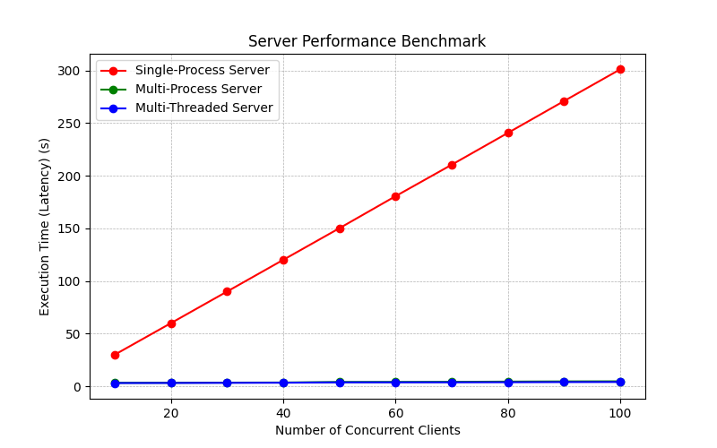
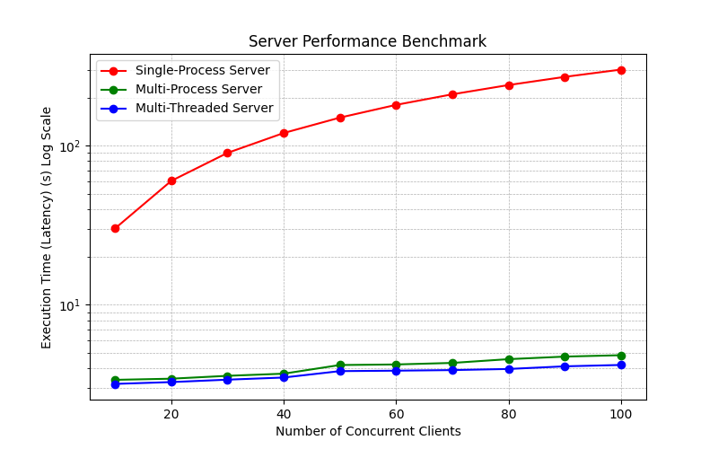
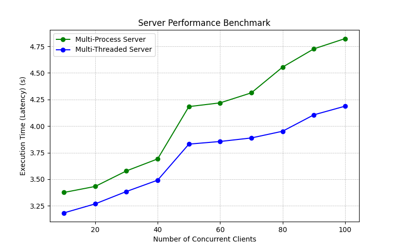

# CS-331-Benchmarking-Client-Server-Architectures

**Single-Process Server**: Handles one client at a time.\
**Multi-Process Server**: Spawns a new process for each client.\
**Multi-Threaded Server**: Uses threads to handle multiple clients concurrently.

### Running the Servers

Start the desired server in a separate terminal:

```sh
python3 single_process_server.py
python3 multi_process_server.py
python3 multi_threaded_server.py
```

### Running the Benchmark

Execute the benchmarking script to test each server implementation with different client loads:

```sh
./finalBenchmark.sh
```

This script:

- Runs each server with a range of concurrent clients (10 to 100).
- Records execution time (latency) for each test.
- Generates performance plots.

Alternatively, you can manually test a specific client load:

```sh
./start.sh client.py 10
```

## Performance Evaluation

After running the benchmarks, execute:

```sh
python3 plot_results.py
```

This script generates and saves plots comparing the performance of all three server types.

## Expected Results

- **Single-Process Server**: Latency increases linearly as clients wait sequentially.
- **Multi-Process Server**: Can handle multiple clients concurrently but has higher overhead because new processes are created.
- **Multi-Threaded Server**: Best scalability due to lightweight threads.

## Results Visualization

| Clients | Single-Process Server (s) | Multi-Process Server (s) | Multi-Threaded Server (s) |
| ------- | ------------------------- | ------------------------ | ------------------------- |
| 10      | 30.19703                  | 3.37562                  | 3.18338                   |
| 20      | 60.13437                  | 3.43206                  | 3.26826                   |
| 30      | 90.13987                  | 3.57823                  | 3.38463                   |
| 40      | 120.21113                 | 3.69099                  | 3.49122                   |
| 50      | 150.23126                 | 4.18303                  | 3.83011                   |
| 60      | 180.65150                 | 4.21820                  | 3.85501                   |
| 70      | 210.52304                 | 4.31251                  | 3.88819                   |
| 80      | 240.71175                 | 4.55438                  | 3.95132                   |
| 90      | 270.95691                 | 4.72590                  | 4.10546                   |
| 100     | 301.04635                 | 4.82261                  | 4.18694                   |

**Execution Time vs. Number of Clients**


**Execution Time(in log scale) vs. Number of Clients**


**Comparison of Multi-Process and Multi-Threaded Servers**


## Conclusion

This benchmarking experiment demonstrates that while all three server designs function correctly:

- The **Single-Process Server** is inefficient for high concurrency.
- The **Multi-Process Server** improves performance but incurs process creation overhead.
- The **Multi-Threaded Server** offers the best performance and scalability for concurrent requests.

---

**Author:** Bhavik Patel - 22110047  
**Institution:** IIT Gandhinagar
